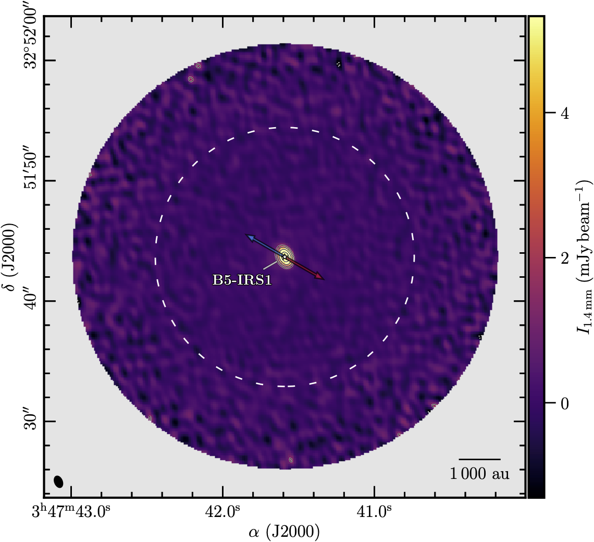
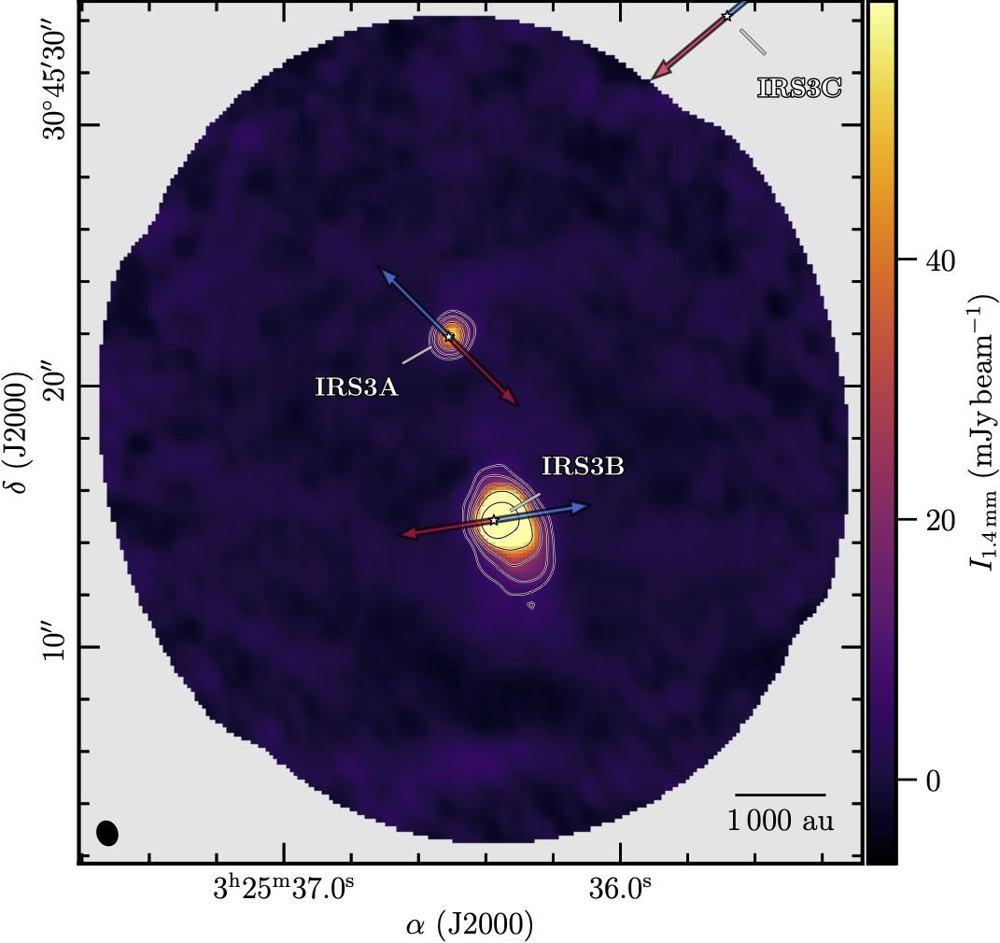
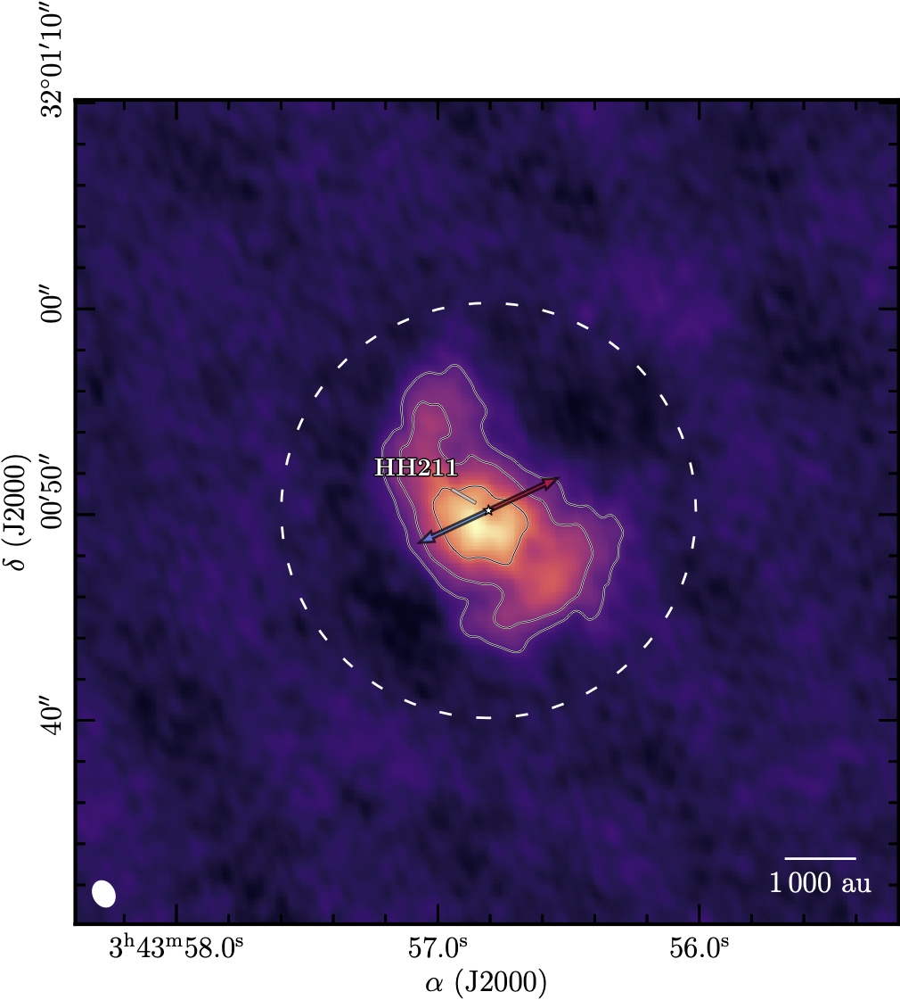
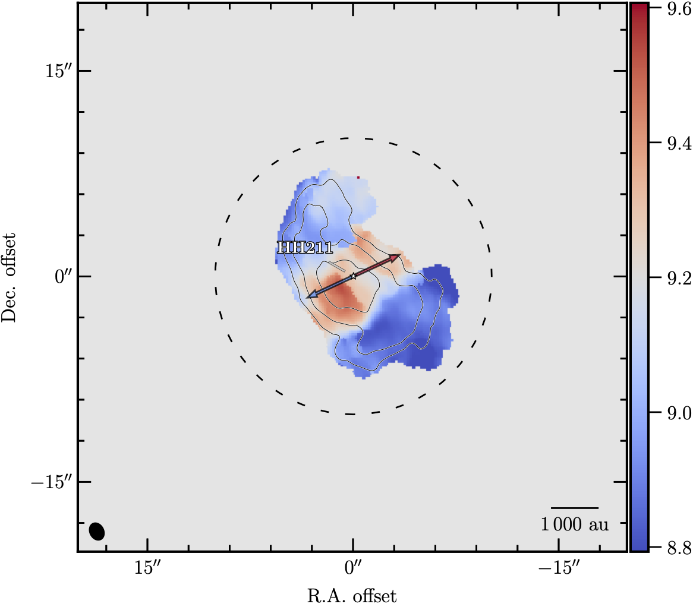

Usage
=====

Data processing
---------------

We have developed a set of functions to help you process your data. This is continuously evolving 
to include more features to enable individual projects.

Convolve and Match cubes
^^^^^^^^^^^^^^^^^^^^^^^^

A common task is to convolve and match the cubes to a common resolution. This is usually required 
to enable the comparison of different cubes, e.g., to derive abundances or column density ratios.
The function ``regrid_cubes_from_files`` will take a list of cubes and a template cube. 
It will convolve the cubes to the smallest beam that is common to all the cubes in the list,
and then regrid the cubes to the same resolution as the template cube.
The function will also add a suffix to the output files to indicate that they have been convolved and matched.
Usually the template file used is the lowest frequency cube, 
as this is the one that will have the largest beam and pixels.

.. code:: python

    from prodige_core import data_handler
    from glob import glob

    # get file list of data cubes
    fits_files = glob('HH211*.fits')
    # get the template file
    template_file = 'HH211_13CO_2-1.fits'
    # convolve and match the cubes to the template
    data_handler.regrid_cubes_from_files(fits_files, 
                                         template_file, 
                                         suffix = '_conv_match')

If you only want to convolve the cubes to a common beam, without regridding, 
it can be done with the function ``common_beam_files``.

.. code:: python

    from prodige_core import data_handler
    from glob import glob

    # get file list of data cubes
    fits_files = glob('HH211*.fits')
    # convolve the cubes to the common beam
    data_handler.common_beam_files(fits_files, suffix = '_conv')

Making figures
--------------

We developed a set of functions to help you make publication ready figures, 
which can be used with your own custom made plotting routines.
This includes commands with the information of the source names, 
known outflows directions, primary beam sizes, and other information.

In addition, we have also created a couple of wrapper functions to 
create publications ready figures with a single command.

Single-pointing Continuum
^^^^^^^^^^^^^^^^^^^^^^^^^
The function ``plot_continuum`` will create a figure with the continuum map 
of a single pointing observations towards the source, 
adding the outflow direction, the primary beam size, and the source name. 
The function will also save the figure in the current working directory 
with the name of the source and the baseband.

.. code:: python

    import os
    import prodige_core as pcore
    # NOEMA data directory
    data_directory = os.getcwd() + '/'

    # # name of the region
    region = 'B5-IRS1'
    # continuum baseband
    bb = 'lo'
    print('>>>>> ' + region + ' continuum of single pointing')
    pcore.plot_continuum(region, bb, data_directory, cmap='inferno', mosaic=False,
                        color_nan='0.9', do_marker=True, do_outflow=True,)

    Example of a continuum map of Barnard5-IRS1 with the outflow direction and the primary beam size.

Continuum Mosaic
^^^^^^^^^^^^^^^^
The function ``plot_continuum`` can also handle continuum data from different 
pointings mosaiced together.
the outflow direction, the primary beam size, and the source name. 
The function will also save the figure in the current working directory 
with the name of the source and the baseband.

.. code:: python

    import os
    import prodige_core as pcore
    # NOEMA data directory
    data_directory = os.getcwd() + '/'

    # # name of the region
    region = 'L1448N'
    # continuum baseband
    bb = 'li'
    print('>>>>> ' + region + ' continuum of Mosaic')
    pcore.plot_continuum(region, bb, data_directory, cmap='inferno', mosaic=True,
                        color_nan='0.9', do_marker=True, do_outflow=True,)

    Example of a continuum map of L1448N with the outflow direction.

Line Integrated Intensity Maps
^^^^^^^^^^^^^^^^^^^^^^^^^^^^^^

The function ``plot_line_mom0`` will create a figure with the integrated intensity map
of a single pointing (or mosaicked) observations towards the source,
adding the outflow direction, the primary beam size (for single pointing), 
and the source name.
The function will also save the figure in the current working directory
with the name of the source and the baseband.

.. code:: python

    import os
    import prodige_core as pcore
    # NOEMA data directory
    data_directory = os.getcwd() + '/'

    # # name of the region
    region = 'HH211'
    # linename
    linename = 'N2Dp_K'
    bb = 'li'
    print('>>>>> ' + region + ' Integrated Intensity')
    pcore.plot_line_mom0(region, linename, bb, data_directory, mosaic=False,
                        color_nan='0.9', do_marker=True, do_outflow=True,)

    Example of a integrated intensity map of HH211 with the outflow direction 
    and the primary beam size.

Centroid Velocity Maps
^^^^^^^^^^^^^^^^^^^^^^

The function ``plot_line_vlsr`` will create a figure with the centroid velocity map
of a single pointing (or mosaicked) observations towards the source,
adding the outflow direction, the primary beam size (for single pointing),
and the source name.
The function will also save the figure in the current working directory
with the name of the source and the baseband.

.. code:: python

    import os
    import prodige_core as pcore
    # NOEMA data directory
    data_directory = os.getcwd() + '/'

    # # name of the region
    region = 'HH211'
    # linename
    linename = 'N2Dp_K'
    bb = 'li'
    print('>>>>> ' + region + ' Velocity map')
    pcore.plot_line_vlsr(region, linename, data_directory, mosaic=False,
                     color_nan='0.9', do_marker=True, do_outflow=True, do_offsets=True)

    Example of a centroid velocity map of HH211 with the outflow direction 
    and the primary beam size.
